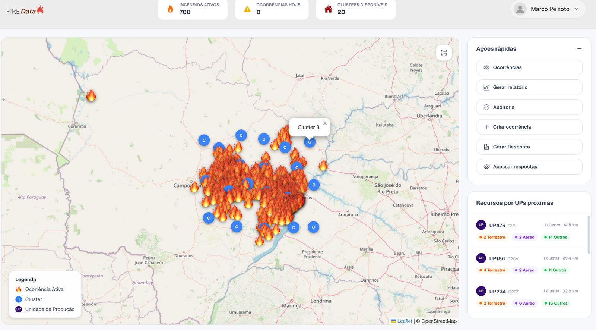
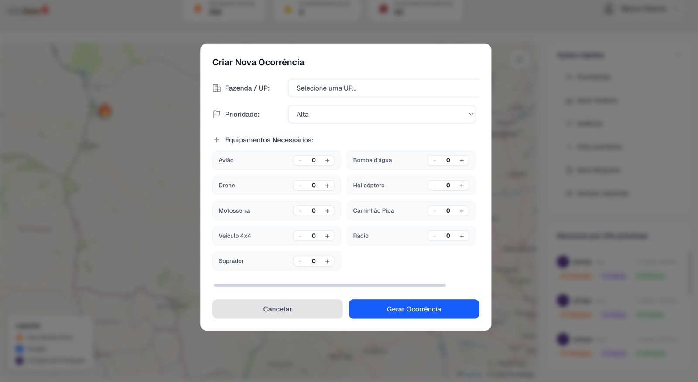

# Teste de Usabilidade - Semana 10

Esta atividade refere-se à entrega da semana 10 de teste de usabilidade com foco na técnica do funil. Essa técnica tem como objetivo avaliar a experiência do usuário através de perguntas estruturadas que buscam afunilar o escopo do teste, direcionando a análise para o objetivo principal da interação dentro da aplicação.

---

## 1. Telas Analisadas

**Telas:**
- Tela inicial (home)
- Tela de criação de novas ocorrências

<h2 align="center">Home</h2>

  

<h2 align="center">Criar Ocorrência</h2>

  

**Descrição:**
A tela inicial apresenta as principais funcionalidades da aplicação, enquanto a tela de criação de ocorrências permite o registro de novos incidentes para atuação da equipe.

---

## 2. Tipo de Teste

**Tipo:** Tarefa  

**Descrição:**  
O teste consiste em avaliar se o usuário consegue compreender a interface e executar o fluxo de criação de uma nova ocorrência de forma intuitiva, a partir das informações disponíveis nas telas.

**Tarefas:**

- **Tarefa 1 (Exploratória):**  
A partir da tela inicial, analise as informações presentes na tela e explore suas funcionalidades.

- **Tarefa 2 (Direcionada):**  
Após a exploração, crie uma nova ocorrência de incêndio para atuação da equipe.

---

## 3. Conjunto de Perguntas

1. Nesta tela inicial, o que você vê?  
2. Dentro das funcionalidades presentes na tela, o que você deduz que seja cada coisa?  
3. No caso de criar uma nova ocorrência, por onde iria?  
4. Dentro desta tela de criação de ocorrências, as categorias estão claras?  
5. Ao criar a ocorrência, sente que todo o percurso foi claro ou tem informações que ficaram confusas ou pouco intuitivas?  

---

## 4. Objetivo do Teste

O teste tem como objetivo verificar se o usuário consegue identificar e executar corretamente o fluxo de criação de nova ocorrência de forma intuitiva e sem dificuldades.

---

## 5. Ação ou Entendimento Esperado

A partir do teste executado, espera-se que o usuário consiga identificar onde iniciar a criação de uma ocorrência, compreender as funcionalidades disponíveis e concluir o processo de forma clara, sem confusão ou necessidade de auxílio.
